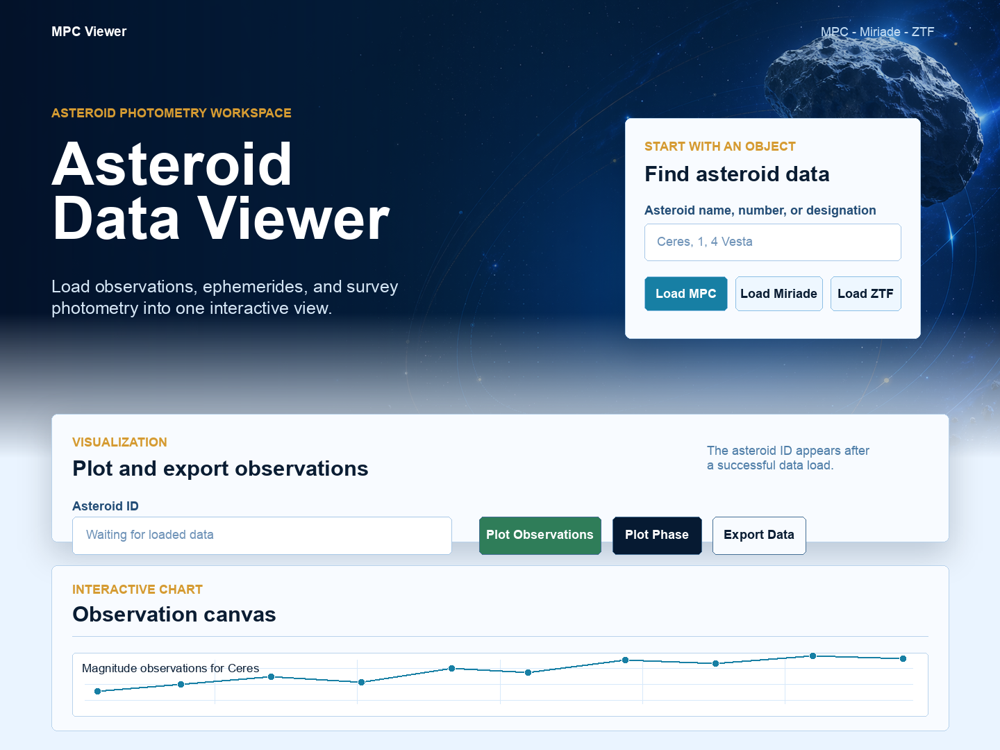

# Asteroid Data Viewer

A web application for visualizing asteroid observation data from multiple sources including Minor Planet Center (MPC), IMCCE Miriade, and Zwicky Transient Facility (ZTF). The interface uses a public-facing astronomy design with a generated blue asteroid hero image, a focused object search panel, and a dedicated plotting workspace.



## Features

- **Multi-Source Data Retrieval**: Fetch asteroid data from several key astronomical databases:
  - Minor Planet Center (MPC): Official observation data with magnitude information
  - IMCCE Miriade: Ephemeris data for phase angle calculations
  - Zwicky Transient Facility (ZTF): Additional photometric observations

- **Interactive Visualization**:
  - Time-series magnitude plots
  - Phase-magnitude relation plots
  - Color-coded observatory identification
  - Responsive chart frame sized to fit generated Plotly figures

- **Data Caching**: Stores retrieved data locally to avoid redundant API calls and enable offline usage

- **Redesigned Astronomy UI**:
  - Blue-toned generated asteroid hero background
  - Search and data-source controls in the first viewport
  - Separate visualization panel for plotting and exporting
  - Responsive layout for desktop and mobile screens

## Interface Design

The current design is organized around two main areas:

1. **Hero search area**: A cinematic blue asteroid background introduces the app while keeping the asteroid identifier field and MPC/Miriade/ZTF load buttons immediately available.
2. **Visualization workspace**: The lower panel contains the loaded asteroid ID, plot controls, export menu, and an interactive chart frame sized for Plotly output.

The README screenshot lives at `static/images/readme-screenshot.png`, and the generated hero asset used by the page lives at `static/images/generated-asteroid-hero-layout.png`. The active styling is in `static/css/styles.css`, and the existing JavaScript hooks are preserved in `templates/index.html` so the data-loading, plotting, and export behavior continue to work.

## Prerequisites

- Python 3.x
- Flask
- Pandas
- NumPy
- Plotly
- Astropy
- Astroquery

## Installation

1. Clone the repository:
```bash
git clone https://github.com/AlexeySergeyev/mpc_viewer.git
cd mpc_viewer
```

2. Create a virtual environment and activate it:
```bash
python -m venv venv
source venv/bin/activate  # On Windows: venv\Scripts\activate
```

3. Install required packages:
```bash
pip install flask pandas numpy plotly astropy astroquery requests
```
or
```bash
pip install -r requirements.txt
```

4. Run the application:
```bash
python3 app.py
```

5. Open your browser and navigate to: [localhost:5000](http://127.0.0.1:5000/)

## Deployment

6. The application is also available online at: [alexeysergeyev.online](https://www.alexeysergeyev.online/)

## Usage

1. **Enter an asteroid identifier** in the input field (name, number, or designation)
2. **Load data** using the appropriate buttons:
   - Load MPC: Retrieves observation data from Minor Planet Center
   - Load Miriade: Fetches ephemeris data (requires MPC data to be loaded first)
   - Load ZTF: Retrieves observations from Zwicky Transient Facility
3. **Generate plots**:
   - Plot Observations: Shows magnitude over time
   - Plot Phase: Shows magnitude vs. phase angle (requires both MPC and Miriade data)
4. **Export data** from the visualization panel:
   - All sources as a ZIP archive
   - MPC, Miriade, or ZTF as individual CSV files

## Project Structure

```
mpc_observations/
├── app.py              # Main Flask application
├── static/             # Static assets
│   ├── css/            # CSS stylesheets
│   │   └── styles.css  # Custom styles
│   ├── images/         # UI images
│   │   ├── readme-screenshot.png
│   │   └── generated-asteroid-hero-layout.png
│   └── js/             # JavaScript files
│       └── app.js      # Client-side functionality
├── templates/          # HTML templates
│   └── index.html      # Main application page
├── tests/              # Frontend structure regression tests
└── db/                 # Data storage directory
    ├── designation/    # Asteroid designation data
    ├── miriade/        # Cached Miriade data
    ├── mpc/            # Cached MPC data
    └── ztf/            # Cached ZTF data
```

## API Endpoints

- `/fetch_mpc`: Retrieves and stores observation data from MPC
- `/fetch_miriade`: Retrieves ephemeris data from IMCCE Miriade
- `/fetch_ztf`: Retrieves observation data from ZTF
- `/plot_observations`: Generates time-series magnitude plots
- `/plot_phase`: Generates phase-magnitude relation plots

## Data Sources

- [Minor Planet Center](https://www.minorplanetcenter.net/)
- [IMCCE Miriade](https://ssp.imcce.fr/webservices/miriade/)
- [Zwicky Transient Facility](https://www.ztf.caltech.edu/)

## License

This project is licensed under the MIT License - see [LICENSE](LICENSE) for details.

## Acknowledgements

- Minor Planet Center for providing asteroid observation data
- IMCCE for the Miriade ephemeris service
- Zwicky Transient Facility for photometric data
- Plotly for interactive visualization capabilities
